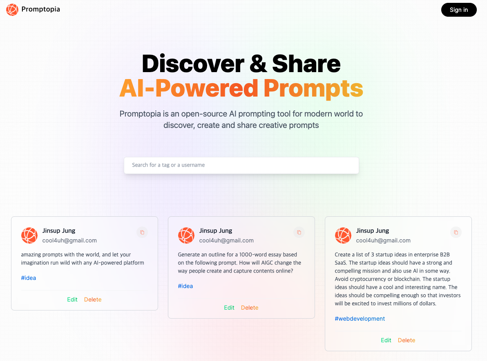
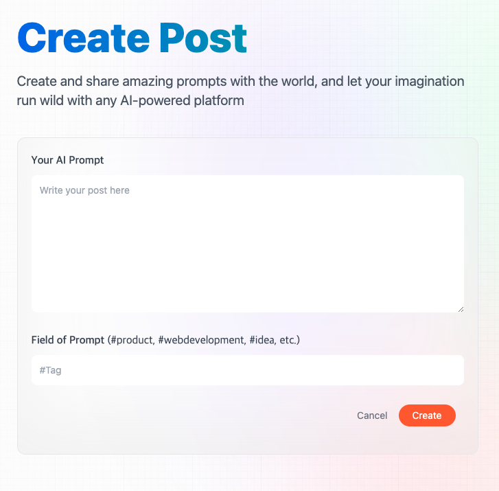

This is a [Next.js](https://nextjs.org/) project bootstrapped with [`create-next-app`]

# 프로젝트명: 프람토피아 (promptopia)
> ChatGPT Prompt 생성, 게시와 공유를 위한 사이트

프롬프트 거래와 커뮤니티 활성화 목적




## 설치 방법

OS X & 리눅스:

```sh
npm install book-matching --save
```

윈도우:

```sh
edit autoexec.bat
```

## 사용 예제


